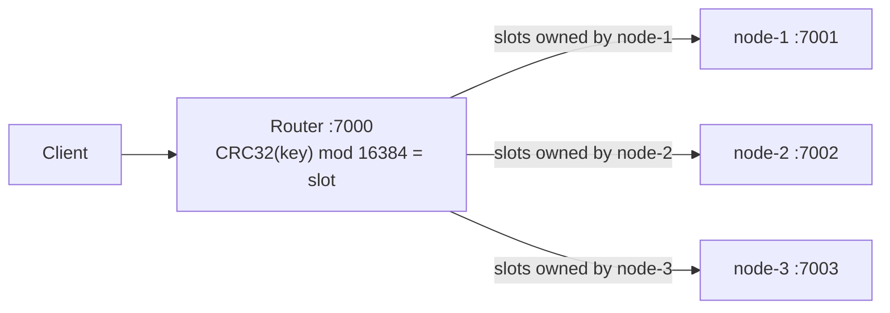

# Coda KV store take-home

An in-memory JSON key-value store over HTTP, built in three steps: one node, then several nodes
behind a router, then a design for nodes that join and leave at runtime.

## Parts

| Part | Folder | What it is |
|------|--------|------------|
| 1 | [part1/coda-kv-store](part1/coda-kv-store/README.md) | Single-node store: `GET`, `PUT` and `PATCH /kv/{key}`, per-key versions and `ifVersion`. |
| 2 | [part2/coda-kv-store-node](part2/coda-kv-store-node/README.md) | Storage node: the Part 1 store plus a node id and a local key listing. |
| 2 | [part2/coda-kv-router](part2/coda-kv-router/README.md) | Router: sends each key to one owner node using hash slots, and lists all keys. |
| 3 | [part3/coda-kv-store-roadmap](part3/coda-kv-store-roadmap/ROADMAP.md) | Design only: dynamic membership and discovery with Redis. |

Each project has its own README with the API, design decisions and known limits. This page only
links them together.

## Architecture at a glance



- Clients talk only to the router. Each key has exactly one owner node, so per-key atomicity and
  versions work as in Part 1.
- Part 1 is the single-node case: one process on `:7000`, no router.
- Part 3 is a design document. Nothing in it is implemented.

## Prerequisites

- JDK 25. The projects use Spring Boot 4.1.1 and will not build on an older JDK.
- Maven is not needed. Each project ships the Maven wrapper (`./mvnw`).
- `curl` and `bash`, for the run scripts.

The scripts use `JAVA_HOME` if it is set, otherwise `java` from `PATH`. Part 1's `run.sh` also
falls back to the first JDK under `~/.jdks`. If your default `java` is older than 25, point
`JAVA_HOME` at a JDK 25 first, for example:

```bash
export JAVA_HOME=~/.jdks/temurin-25.0.4.1
```

## Quick start

All commands below start from the repository root. Each script builds first; add `--skip-build`
to reuse jars that are already built. Ctrl+C stops everything.

### Part 1: single node

Starts the store on <http://localhost:7000>:

```bash
part1/coda-kv-store/scripts/run.sh
```

Try it:

```bash
curl -i -X PUT localhost:7000/kv/user:42 -H 'Content-Type: application/json' -d '{"name":"Ari","points":10}'
curl -i localhost:7000/kv/user:42
```

### Part 2: three nodes and the router

Starts node-1 to node-3 on `127.0.0.1:7001` to `7003` and the router on <http://localhost:7000>.
Stop Part 1 first, since both use port 7000. Logs go to `part2/coda-kv-router/target/demo-logs/`.

```bash
NODE_DIR=../coda-kv-store-node part2/coda-kv-router/scripts/run-demo.sh
```

`NODE_DIR` tells the script where the storage node project is, relative to the router project.
The script prints example `curl` commands when everything is up. The `X-Kv-Node` response header
shows which node owns a key, and `curl localhost:7000/kv` lists every key as NDJSON.

To start only the nodes and run the router yourself, use
`part2/coda-kv-store-node/scripts/run-nodes.sh`; it prints the router command when the nodes are up.

## Running the tests

Part 1:

```bash
(cd part1/coda-kv-store && ./mvnw test)
```

Part 2 storage node. `install` also runs the tests, and puts the node jar in the local Maven
repository, which the router's tests need:

```bash
(cd part2/coda-kv-store-node && ./mvnw install)
```

Part 2 router. Run the node `install` above once first:

```bash
(cd part2/coda-kv-router && ./mvnw test)
```

The router tests start three real nodes and the router in one JVM, including a stopped node and
a node that never answers.

## Assumptions and known limits

Each project lists these in full; the short version:

- Data is in memory only and is lost when a process stops. See Part 1,
  [Known limits](part1/coda-kv-store/README.md#known-limits).
- `ifVersion` on a missing key returns `404`, not `409`. See Part 1,
  [Design decisions and tradeoffs](part1/coda-kv-store/README.md#design-decisions-and-tradeoffs).
- The node list is static and the router is a single process. A node that is down makes its keys
  return `503`; there is no failover or rebalancing. See the router's
  [Known limits](part2/coda-kv-router/README.md#known-limits).
- Nodes trust any caller and should only be reachable through the router. See the node's
  [Known limits](part2/coda-kv-store-node/README.md#known-limits).
- Part 3 describes how to lift the static node list, and its risks and open questions. See
  [ROADMAP.md](part3/coda-kv-store-roadmap/ROADMAP.md).

## Suggested reading order

1. [Part 1 README](part1/coda-kv-store/README.md): the API and the core semantics everything else
   keeps.
2. [Storage node README](part2/coda-kv-store-node/README.md): what changes when the store becomes
   one of several nodes.
3. [Router README](part2/coda-kv-router/README.md): hash slots, proxying and failure handling.
4. [Part 3 roadmap](part3/coda-kv-store-roadmap/ROADMAP.md): the design for dynamic membership.
