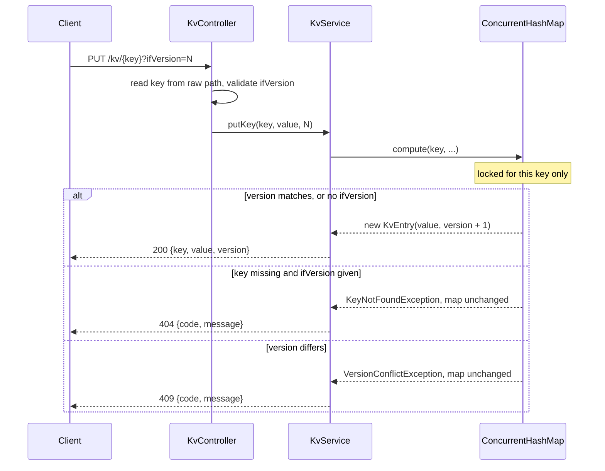

# coda-kv-store (Part 1)

A single-node, in-memory key-value store over HTTP, with JSON values and per-key versions. This is
Part 1 of the assignment.

## Status and scope

In scope:

- `GET`, `PUT` and `PATCH` on `/kv/{key}`.
- Any JSON value: object, array, string, number, boolean or null.
- A version per key, and conditional writes with `?ifVersion=N`.
- Atomic writes per key, safe under many parallel clients.
- One error shape, `{code, message}`, for every error the app handles.

Not in scope:

- Persistence. Data is lost when the process stops.
- More than one node, replication or partitioning. Part 2 adds these.
- `DELETE`, expiry (TTL), authentication.
- Limits on body size or number of keys.

## Quick start

You need JDK 25. Maven is not needed, because the project ships the Maven wrapper (`./mvnw`).

Build and start on <http://localhost:7000>:

```bash
scripts/run.sh
```

Start the jar that is already in `target/`, without building:

```bash
scripts/run.sh --skip-build
```

Any further arguments go to Spring Boot:

```bash
scripts/run.sh --server.port=8080
```

`run.sh` uses `JAVA_HOME` if it is set, otherwise `java` from `PATH`. If neither exists, it uses
the first JDK under `~/.jdks`, which is where IntelliJ downloads JDKs. Press Ctrl+C to stop the
server.

Run the tests:

```bash
./mvnw test
```

Without the script, set `JAVA_HOME` yourself and run:

```bash
./mvnw -DskipTests package && java -jar target/coda-kv-store-0.0.1-SNAPSHOT.jar
```

## API reference

All endpoints are under `/kv/{key}`. Request and response bodies are JSON. A successful response
always has this shape:

```json
{ "key": "user:1", "value": "<any JSON>", "version": 3 }
```

Swagger UI is at <http://localhost:7000/swagger-ui.html>.

### Keys

The key is everything after `/kv/`, decoded from percent-encoding as UTF-8. Spaces (`%20`),
unicode, `%` (`%25`), `;` and `.` all work. For example, `/kv/a;b` is the key `a;b`. A key cannot
contain `/`. See Known limits.

### GET /kv/{key}

Returns the current value and version. Returns `404` if the key does not exist.

```bash
curl -s localhost:7000/kv/user:1
```

```json
{"key":"user:1","value":{"name":"Ann","age":30},"version":1}
```

### PUT /kv/{key}[?ifVersion=N]

Replaces the whole value, and creates the key if it does not exist. The body is the new value.

```bash
curl -s -X PUT localhost:7000/kv/user:1 -H 'Content-Type: application/json' -d '{"name":"Ann","age":30}'
```

```json
{"key":"user:1","value":{"name":"Ann","age":30},"version":1}
```

### PATCH /kv/{key}[?ifVersion=N]

Merges the body into the current value:

- If the current value and the body are both JSON objects, their top-level fields are merged.
  Fields in the body overwrite existing fields. Nested objects are replaced, not merged.
- Otherwise the body replaces the value, like `PUT`. This includes a key that does not exist yet.
- A `null` field in the body sets that field to `null`. It does not delete the field.
- Arrays are replaced, never joined.

```bash
curl -s -X PATCH localhost:7000/kv/user:1 -H 'Content-Type: application/json' -d '{"age":31,"city":"Bangkok"}'
```

```json
{"key":"user:1","value":{"name":"Ann","age":31,"city":"Bangkok"},"version":2}
```

### Versions and ifVersion

- A new key starts at version 1. Every successful `PUT` or `PATCH` adds 1, even if the value is
  the same.
- Without `ifVersion`, a write always succeeds. The last writer wins.
- With `?ifVersion=N`, the write succeeds only if the current version is exactly `N`. Otherwise
  it returns `409` and changes nothing.
- Any `ifVersion` on a key that does not exist returns `404`, and the key is not created. To
  create a key, write without `ifVersion`.
- `ifVersion` must be one 32-bit integer. An empty, repeated or non-numeric value returns `400`.
  It is never ignored, so a conditional write cannot turn into an unconditional one by mistake.

To update safely, read the key, then write with its version. On `409`, read again and retry. On
`404`, the key was never created, so create it without `ifVersion`.

```bash
curl -s -X PUT 'localhost:7000/kv/user:1?ifVersion=1' -H 'Content-Type: application/json' -d '{"name":"Ann","age":32}'
```

If the key is already at version 2, the response is:

```json
{"code":409,"message":"Version conflict on key user:1: expected 1, actual 2"}
```

### Errors

Every error the app handles has this shape:

```json
{ "code": 404, "message": "Key not found: nope" }
```

| Status | When |
|--------|------|
| 400 | The body is missing or is not valid JSON. This includes nesting deeper than 500 levels. |
| 400 | `ifVersion` is empty, repeated or not an integer. |
| 404 | `GET` on a key that does not exist, or an unknown route. |
| 404 | `PUT` or `PATCH` with `ifVersion` on a key that does not exist. Nothing is created. |
| 405 | The HTTP method is not supported on the route. |
| 409 | `ifVersion` does not match the current version of an existing key. |
| 500 | An unexpected error. It is logged on the server and the message is generic. |

Two cases do not use this shape. See Known limits.

## How it works

The controller takes the key from the raw request path and passes it to `KvService`. The service
keeps every entry in one `ConcurrentHashMap<String, KvEntry>`. A `KvEntry` is an immutable record
of `(value, version)`.

Each write runs inside `ConcurrentHashMap.compute` for its key. Inside that call, the service
checks `ifVersion`, builds the new value and stores it with the next version. Because `compute`
runs one call at a time per key, the check and the write are atomic. Writes to different keys do
not wait for each other. If the version check fails, the exception leaves the map unchanged.



Values are deep-copied when they are stored, so nothing outside the map can change a stored
value. `GlobalExceptionHandler` turns every handled exception into the `{code, message}` shape.

## Configuration

Set these in `src/main/resources/application.properties`, or pass them as `--name=value` to
`scripts/run.sh`.

| Property | Default | Meaning |
|----------|---------|---------|
| `server.port` | `7000` | HTTP port. |
| `spring.application.name` | `code-kv-store` | Name shown in the logs. |

## Testing

```bash
./mvnw test
```

`KvApiTests` starts the app on a random port and calls it over real HTTP. It covers:

- `GET`, `PUT` and `PATCH`, and the version going up on each write.
- `ifVersion` conflicts (`409`), `ifVersion` on a missing key (`404`, nothing created), and
  empty, repeated or too-large `ifVersion` values.
- The `PATCH` merge rules.
- Keys with `;`, spaces, unicode and `%`.
- The error shape for `400`, `404`, `405` and `409`.
- Concurrency: 3 clients each add 1 to a counter 100 times. Each client reads the key and writes
  with `ifVersion`, and retries on `409`. The final value must be exactly 300.

## Design decisions and tradeoffs

**One in-memory map with atomic per-key updates**

- Why: Required by the assignment spec.
- Alternative considered: explicit locks around each key, or a database.
- Tradeoff: `ConcurrentHashMap.compute` gives per-key atomicity with no lock code and no extra
  service to run. The cost is that data does not survive a restart and must fit in memory.

**`ifVersion` as a query parameter**

- Why: Required by the assignment spec.
- Alternative considered: the standard `If-Match` header with ETags, answered with `412`.
- Tradeoff: a query parameter is easy to see and to send from curl. It is not the HTTP standard,
  so generic HTTP clients and caches do not understand it.

**`PATCH` merges top-level fields only**

- Why: Required by the assignment spec.
- Alternative considered: a deep merge, or JSON Merge Patch (RFC 7386), where nested objects are
  merged and a `null` field deletes the field.
- Tradeoff: a shallow merge is simple and predictable. A client that wants to change one nested
  field must send the whole nested object.

**`404` for `ifVersion` on a key that does not exist**

- Why: The spec does not say what happens in this case, so this is our choice. The key does not
  exist, which is what `404` means, and it matches what `GET` returns for the same key.
- Alternative considered: `409`, treating a missing key as a version mismatch, or `412`, as with
  `If-Match`.
- Tradeoff: a client can tell "the key is gone" apart from "someone else wrote first". A retry
  loop must handle `404` as well as `409`, and `404` alone does not say whether the key or the
  route is missing. The message (`Key not found: ...`) says which.

**No `DELETE` and no persistence**

- Why: Outside the scope of the spec for Part 1.
- Alternative considered: a `DELETE` endpoint, and writing data to disk.
- Tradeoff: the store stays small. Keys can never be removed, and all data is lost on restart.

## Known limits

These are left as they are on purpose.

- **No `/` in keys.** A plain `/` is a different route. Tomcat rejects `%2F`.
- **Some bad URLs get an HTML error.** Tomcat rejects `%2F`, `%5C`, `%00` and URLs longer than
  about 8 KB before the app sees them. The response is Tomcat's HTML `400` page, not
  `{code, message}`.
- **Non-JSON `Accept` header.** A request that asks for a format other than JSON gets an empty
  `406`.
- **No size limits.** The app does not cap the body size or the number of keys. A 30 MB value is
  accepted, so one client could fill the server's memory. Jackson rejects a single string above
  its own limit with `400`.
- **Version is an `int`.** It would wrap around after about 2 billion writes to one key.
- **No persistence.** All data is lost when the process stops.

## Layout

```
scripts/run.sh                       Build and run helper
src/main/java/org/example/codakvstore/
  CodaKvStoreApplication.java        Spring Boot entry point
  controller/KvController.java       /kv/{key} endpoints
  controller/dto/                    Response bodies
  service/KvService.java             Storage, versions, merge rules
  model/KvEntry.java                 (value, version) record
  exception/                         Error types and the {code, message} handler
src/main/resources/application.properties
src/test/java/org/example/codakvstore/KvApiTests.java   End-to-end HTTP tests
```

## Related parts

- Part 1, this project: a single-node store.
- Part 2, storage node: [../coda-kv-store-part2](../coda-kv-store-part2). This store, run as one
  of several nodes.
- Part 2, router: [../coda-kv-router](../coda-kv-router). Splits keys across the nodes.
- Part 3, design only: [../coda-kv-store-roadmap](../coda-kv-store-roadmap). Nodes joining and
  leaving at runtime.
