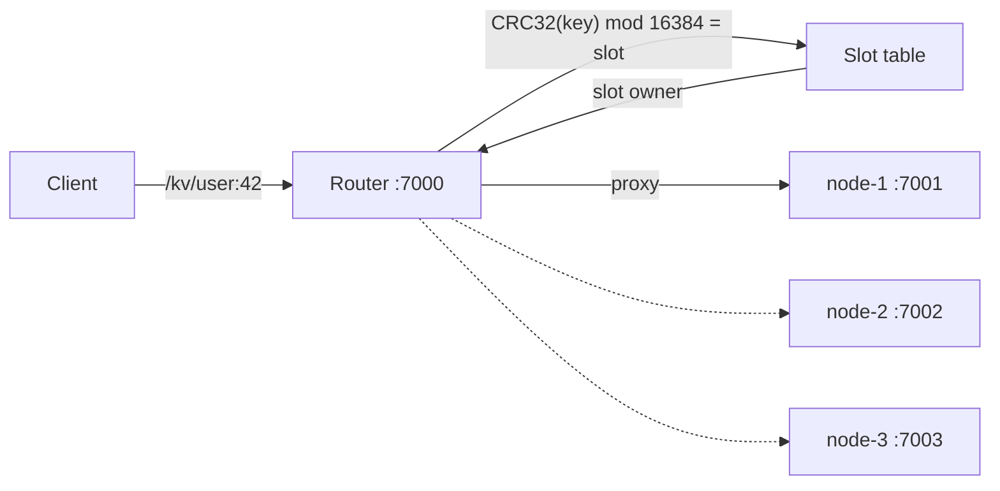

# coda-kv-router (Part 2 router)

A router process that spreads keys over several storage nodes using hash slots, for Part 2 of the KV Store assignment (multi-node scale-out).

## Status and scope

In scope:

- One router in front of a static list of storage nodes (`../coda-kv-store-part2`). Clients talk only to the router.
- Hash-slot routing: each key maps to exactly one owner node.
- Proxying `GET`, `PUT` and `PATCH /kv/{key}` to the owner, with Part 1 semantics and responses unchanged.
- `GET /kv`: every key across all nodes, as NDJSON.
- 503 in the `{code,message}` shape when the owner node is down or too slow.
- A script that starts three nodes and the router for the demo.

Explicitly not in scope:

- Replication, failover or rerouting to another node when one is down.
- Rebalancing, slot migration or adding and removing nodes while running.
- Running more than one router, or any high availability for the router itself.
- Persistence and authentication.

## Quick start

The project needs Java 25. If `java` is not on your `PATH`, point `JAVA_HOME` at a JDK 25 first, for example:

```bash
export JAVA_HOME=~/.jdks/temurin-25.0.4.1
```

Start three nodes and the router. The script installs the node jar from `../coda-kv-store-part2`, builds the router, and waits until everything answers:

```bash
scripts/run-demo.sh
```

Add `--skip-build` to reuse jars that are already built. Logs go to `target/demo-logs/`. Ctrl+C stops everything.

Run the tests. They need the node jar installed once:

```bash
cd ../coda-kv-store-part2 && ./mvnw install && cd -
./mvnw test
```

## API reference

All examples use the router on port 7000. Every proxied response carries `X-Kv-Node: <owner node id>`.

`PUT /kv/{key}` replaces the value. `ifVersion` is optional.

```bash
curl -X PUT 'http://localhost:7000/kv/user:42' -H 'Content-Type: application/json' -d '{"name":"Ari","points":10}'
```

```json
{"key":"user:42","value":{"name":"Ari","points":10},"version":1}
```

`GET /kv/{key}` returns the value and its version.

```bash
curl http://localhost:7000/kv/user:42
```

```json
{"key":"user:42","value":{"name":"Ari","points":10},"version":1}
```

`PATCH /kv/{key}` shallow-merges when both the stored value and the body are JSON objects. Otherwise it replaces. Without `ifVersion` it creates the key if it is missing. `ifVersion` is optional.

```bash
curl -X PATCH 'http://localhost:7000/kv/user:42' -H 'Content-Type: application/json' -d '{"rank":"gold"}'
```

```json
{"key":"user:42","value":{"name":"Ari","points":10,"rank":"gold"},"version":2}
```

`GET /kv` lists every key on every node, one JSON object per line, with `Content-Type: application/x-ndjson`.

```bash
curl http://localhost:7000/kv
```

```
{"key":"user:42","node":"node-1"}
{"key":"user:7","node":"node-2"}
```

Errors use the shape `{"code":<status>,"message":"..."}`. The router passes node errors through unchanged and produces 405 and 503 itself:

| Status | Produced by | When | Example message |
|---|---|---|---|
| 400 | node | Body is not valid JSON | `Request body must be valid JSON` |
| 400 | node | `ifVersion` is not a number | `Invalid value for parameter 'ifVersion'` |
| 404 | node | Key does not exist: GET, or PUT/PATCH with `ifVersion` | `Key not found: nope` |
| 405 | router | Method other than GET, PUT or PATCH | `Method 'DELETE' is not supported.` |
| 409 | node | `ifVersion` does not match the current version of an existing key | `Version conflict on key user:42: expected 1, actual 3` |
| 415 | node | Content-Type is not JSON | `Content-Type 'text/plain;charset=UTF-8' is not supported.` |
| 503 | router | The owner node cannot be reached | `Node node-2 is unavailable` |
| 503 | router | The owner did not answer a write in time | `Node node-2 did not respond in time; the write may or may not have been applied` |
| 503 | router | `GET /kv` and a node reports a different id than configured | `Node node-1 is misconfigured: http://127.0.0.1:7002 reports node id 'node-2'` |

## How it works



Routing a key request:

1. The router takes the key exactly as Spring on the node will parse it from the path.
2. `slot = CRC32(UTF-8 bytes of the key) mod 16384`.
3. The node ids are sorted, and the 16384 slots are split into equal contiguous ranges, one per node (`owner = nodes[slot * N / 16384]`). The table depends only on the set of node ids, so it is the same on every start.
4. The router forwards the request to the owner once: same method, raw path, full query string (including `ifVersion`), `Content-Type` and body. It returns the owner's status, `Content-Type` and body unchanged and adds `X-Kv-Node`.

Atomicity: every key has one owner and every request for it goes there. The owner's `ConcurrentHashMap.compute()` serializes writes to that key, so per-key atomicity, versions and `ifVersion` work exactly as in Part 1.

Listing: `GET /kv` calls `/internal/keys` on every node in parallel and waits for all of them. If any node fails, the whole call returns 503 instead of a partial list. Otherwise it writes one `{"key":...,"node":...}` line per key, serialized with Jackson so quotes and newlines in keys are escaped.

Failures: the router never retries and never sends a key to a node other than its owner. A node that refuses the connection, or does not connect within the connect timeout, gives 503 `Node <id> is unavailable`. A node that does not answer within the request timeout gives 503. For PUT and PATCH that message says the write may or may not have been applied.

## Configuration

| Property | Default | Meaning |
|---|---|---|
| `server.port` | `7000` | Router HTTP port. |
| `kv.router.nodes.<node-id>` | none (required) | Base URL of each storage node, for example `kv.router.nodes.node-1=http://127.0.0.1:7001`. The router will not start without at least one. Fixed while the router runs. |
| `kv.router.connect-timeout` | `500ms` | Time allowed to open a connection to a node. |
| `kv.router.request-timeout` | `2s` | Time allowed for a node to answer one request, including `/internal/keys`. |

`run-demo.sh` passes the three demo nodes on the command line.

## Testing

```bash
./mvnw test
```

The tests start real nodes and the router in one JVM, each on a random port:

- `ClusterTests` (3 nodes and the router):
  - The same key reads back the same from repeated requests and is stored only on its owner.
  - 3 concurrent clients doing 100 optimistic increments each through the router end at value 300 and version 301.
  - Random keys land on all three nodes.
  - Keys with `:`, spaces, unicode, `+=&` and a raw `;` reach the right owner.
  - 404 (including `ifVersion` on a missing key), 409 and 400 from the node pass through unchanged, and 405 keeps the `{code,message}` shape.
  - `GET /kv` is NDJSON with exactly the written keys and the right owner for each, including a key containing a newline and quotes.
  - With one node stopped, its keys and `GET /kv` return 503 while keys on the other nodes keep working.
- `SlowNodeTests`: a node that never answers makes a PUT return 503 within the timeout, and the node receives the PUT only once.
- `SlotTableTests`: ownership does not depend on config order, slots split evenly, and an empty node list is refused.

The node's own API tests are in `../coda-kv-store-part2`.

## Design decisions and tradeoffs

- **A separate router process in front of plain storage nodes.**
  - Why: single responsibility and easier maintenance. The router only routes and the nodes only store, so each can change, be deployed and be scaled on its own, and the node code stays the Part 1 service.
  - Alternative considered: every node also acting as a router and proxying to its peers (an earlier version of this part), or clients computing the owner themselves.
  - Tradeoff: one more process to run, and an extra network hop on every request. The router is a bottleneck and a single point of failure. That is accepted because high availability is out of scope. The router holds no data, so several could later run behind a load balancer.
- **Fixed 16384 hash slots, with CRC32 to pick the slot.**
  - Why: slots add a stable layer between keys and nodes. A key's slot never changes; only the slot-to-node table does. If nodes are added or removed later, whole slots move to new owners and every other key stays where it is. With `hash mod N`, changing N moves almost every key. This is what makes membership changes and slot migration possible later (Part 3). CRC32 is cheap, spreads keys evenly, and gives the same result in every process and JVM, unlike `String.hashCode()`, which is not meant to be a stable, well-spread routing hash. 16384 slots is enough to split evenly over many nodes while the table stays small.
  - Alternative considered: `hash mod N`, or consistent hashing with virtual nodes.
  - Tradeoff: a slot table to build and keep identical everywhere. The split is by key count, not by load, so a few hot keys can still overload one node. Today the node list is static, so the benefit is for later.
- **Static node list, fixed for the life of the router.**
  - Why: simple and always consistent. Every start with the same config builds the same slot table, with no coordination needed.
  - Alternative considered: nodes registering with the router, or a registry such as etcd or Consul.
  - Tradeoff: adding or removing a node means a restart, and because nodes are in memory, keys whose slots move are lost.
- **503 when the owner is down, and no rerouting to another node.**
  - Why: to keep things simple at this stage, and for correctness. Sending a key to a node that does not own it would put a second copy of the key on that node, which breaks per-key atomicity and versions. For the same reason the router never retries a PUT or PATCH. A timed-out write may already have been applied, so the 503 says so instead of risking a double write.
  - Alternative considered: failover to another node, or retrying failed requests.
  - Tradeoff: while a node is down, every key it owns is unavailable.
- **`GET /kv` fails with 503 if any node is down.**
  - Why: to keep things simple at this stage. A 200 with keys silently missing would look complete when it is not.
  - Alternative considered: returning the keys that are available, with a marker for the nodes that did not answer.
  - Tradeoff: one node down blocks the whole listing.
- **`GET /kv` collects every node's keys in router memory before writing.**
  - Why: the status code must be decided before any line is written, so a failure can still become a 503.
  - Alternative considered: streaming each node's keys as they arrive, or paging with a cursor.
  - Tradeoff: memory grows with the total number of keys. That is fine at this scale; a very large store would need paging.

## Known limits

- The router is a single process. If it stops, no key is reachable.
- The node list is static. Changing it means restarting the router, and since nodes are in memory, keys whose slots move are lost.
- If a node stops, its keys are unavailable and, after a restart, gone.
- `GET /kv` collects every key in router memory before writing, with no paging.
- A key containing an encoded `/` (`%2F`), `\` (`%5C`) or an invalid `%` escape is rejected by Tomcat with an HTML 400, not the `{code,message}` shape. A Part 1 node does the same.
- A raw `;` in the path starts a path parameter, so `/kv/a;b` means key `a`. Use `%3B` for a `;` inside a key.
- Nodes accept requests from anyone who can reach them. The scripts bind nodes to `127.0.0.1` so clients go through the router.
- A router configured with its own URL as a node forwards to itself until the request timeout, then returns 503.
- Request bodies have no size limit and are held fully in memory.

## Layout

```
coda-kv-router/
  pom.xml                        Spring Boot 4.1.1, Java 25; test dependency on the node jar
  scripts/run-demo.sh            starts node-1..node-3 (127.0.0.1:7001-7003) and the router (:7000)
  src/main/java/org/example/codakvrouter/
    config/                      RouterProperties, HTTP client and slot table beans
    routing/SlotTable.java       CRC32 hash slots and slot owners
    routing/NodeClient.java      calls to nodes, timeouts, 503 errors
    controller/RouterController.java   /kv/{key} proxy and GET /kv listing
    exception/                   {code,message} error handler
  src/test/java/org/example/codakvrouter/
    TestCluster.java             starts nodes and router in one JVM
    ClusterTests.java, SlowNodeTests.java, SlotTableTests.java
```

## Related parts

- Part 1, single node: [../coda-kv-store-part1](../coda-kv-store-part1/README.md)
- Part 2, storage node: [../coda-kv-store-part2](../coda-kv-store-part2/README.md)
- Part 3, roadmap: [../coda-kv-store-roadmap](../coda-kv-store-roadmap/README.md)
