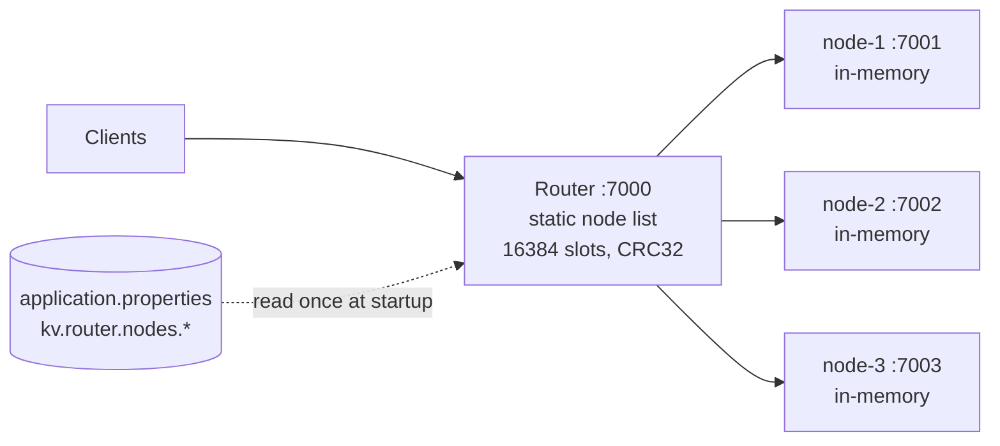
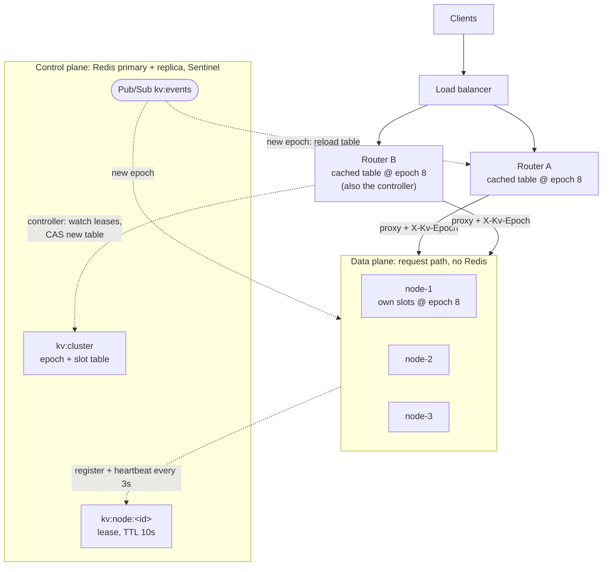
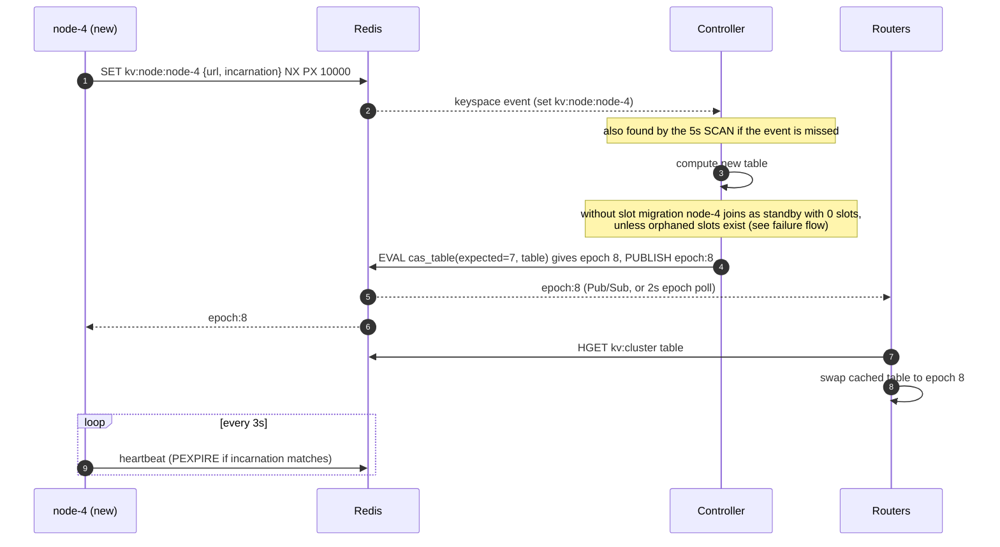
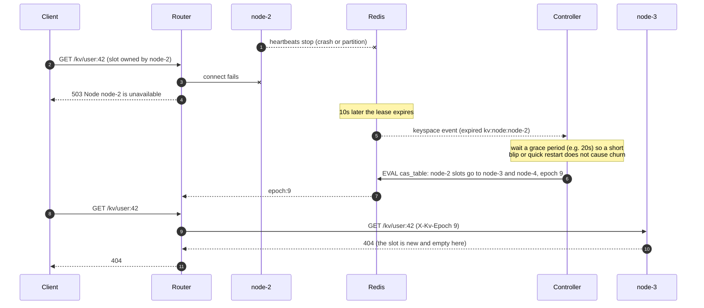

# Part 3: Dynamic membership and discovery (design only)

Roadmap item: let storage nodes join, leave and fail without restarting the router, using **Redis as the
cluster registry**. Nothing here is implemented; Parts 1 and 2 are unchanged.

**In one sentence:** nodes register themselves in Redis with a TTL lease and heartbeat it, a single
controller turns membership changes into a new versioned slot table stored in Redis, and routers and nodes
cache that table locally and fence every request with its epoch, so Redis stays off the request path.

## 1. Where Part 2 stands



- The node list is `kv.router.nodes.<id>=<url>`, read once. Slots are cut into equal ranges over the sorted
  node ids, so the table is a pure function of the config.
- Each key has exactly one owner. The router proxies once, no retries, and answers 503 when the owner is down.
  `GET /kv` fans out to every node and fails with 503 if any is down.

### Why static config falls short

| Problem | Effect today |
|---|---|
| Adding or removing a node | Edit config and restart every router. Restarting with a different node set changes `owner = nodes[slot*N/16384]` for most slots, so most keys silently "move" to a node that does not have them. |
| A node dies for good | Its slots return 503 forever. There is no way to hand them to a live node without a config change and restart. |
| Node address changes (new host, container restart) | Router keeps calling the old URL. |
| Several routers | Each has its own copy of the config. A rolling edit means routers disagree on owners for a while, which can put two copies of a key on two nodes. |
| No liveness signal | The router only learns a node is down when a client request fails. |

## 2. Proposed architecture



Redis is used for **control-plane state only**. A client request never touches Redis: routers and nodes read
the slot table into memory and refresh it when the epoch changes.

### 2.1 Redis data model

| Key | Type | Content | Written by |
|---|---|---|---|
| `kv:node:<id>` | string, TTL 10s | `{"id","url","incarnation","startedAt","state":"active\|draining"}` | the node |
| `kv:cluster` | hash | `epoch` (integer), `table` (JSON slot ranges `[[0,5460,"node-1"],...]`), `updatedBy` | controller only |
| `kv:controller` | string, TTL 10s | id of the router currently acting as controller | controllers |
| `kv:events` | Pub/Sub channel | `epoch:<n>` and `member:<id>:joined/left` hints | controller, nodes |

`incarnation` is a random UUID per process start. It lets everyone tell "node-2 restarted (empty)" from
"node-2 is the same process as before".

### 2.2 Registration, heartbeat and liveness

- **Register:** on startup a node runs `SET kv:node:node-2 <json> NX PX 10000`. `NX` refuses a duplicate id
  while another live process holds it (a quick restart simply waits out the old lease).
- **Heartbeat:** every 3s a small Lua script runs `PEXPIRE kv:node:<id> 10000` *only if* the stored
  incarnation is still its own. If the key is gone (lease lost), the node registers again as a new
  incarnation, which the controller treats as a join.
- **Liveness = the key exists.** A node that crashes, hangs or is cut off stops refreshing and the key expires
  after 10s. No sweeper process is needed; TTL is native.
- **Graceful leave:** on shutdown the node sets `state=draining`, then `DEL`s its key, so the controller does not
  have to wait for expiry.

### 2.3 Noticing membership changes

- Primary signal: **keyspace notifications** (`notify-keyspace-events Kgx$`) on `kv:node:*` for set, del and
  expired events, plus the explicit hints on `kv:events`.
- **Both are lossy.** Pub/Sub is fire-and-forget (a subscriber that reconnects misses messages) and expiry
  events fire when Redis actually deletes the key, which can lag the TTL. So every consumer also does a
  **periodic full resync**: the controller `SCAN`s `kv:node:*` every 5s, and routers/nodes `HGET kv:cluster
  epoch` every 2s. Notifications only make changes fast; the resync makes them correct.

### 2.4 Slot table with epoch, updated atomically

The controller is the **only writer** of `kv:cluster`. It computes a new table and commits it with a
compare-and-set on the epoch in a Lua script, which also publishes the change:

```lua
-- KEYS[1] = kv:cluster   ARGV[1] = expected epoch   ARGV[2] = new table JSON   ARGV[3] = controller id
local cur = tonumber(redis.call('HGET', KEYS[1], 'epoch') or '0')
if cur ~= tonumber(ARGV[1]) then return redis.error_reply('STALE_EPOCH ' .. cur) end
redis.call('HSET', KEYS[1], 'epoch', cur + 1, 'table', ARGV[2], 'updatedBy', ARGV[3])
redis.call('PUBLISH', 'kv:events', 'epoch:' .. (cur + 1))
return cur + 1
```

(`MULTI`/`WATCH` would also work; the script is simpler and runs atomically on the server.)

- **Controller election:** one router holds `kv:controller` via `SET NX PX` and refreshes it. This is only an
  optimisation: if two routers briefly both act as controller, the epoch CAS lets exactly one commit win and the
  other re-reads and recomputes.
- **Bootstrap:** if `kv:cluster` is empty, the controller waits for the expected initial nodes (or a minimum
  count), then writes epoch 1 with the same equal-range split as Part 2. After that the table is **only ever
  edited incrementally**, never recomputed from the sorted node list, so a membership change moves only the
  slots it has to.

### 2.5 Routers and nodes cache the table

- On startup, and whenever they see a higher epoch (Pub/Sub or the 2s poll), routers and nodes load
  `kv:cluster` and swap in an immutable in-memory table. Lookups stay an array index, as in Part 2.
- A component **never accepts a lower epoch** than one it has already seen.
- `GET /kv` fans out to the nodes that own at least one slot in the current table, and each node lists only
  keys in slots it currently owns.

### 2.6 Fencing with the epoch

The router adds `X-Kv-Epoch: <n>` to every proxied request. The node checks, before touching its map:

| Node's view | Node does |
|---|---|
| request epoch == node epoch and node owns the slot | serve normally |
| request epoch < node epoch (stale router) | `421 Misdirected Request` with the node's epoch |
| request epoch > node epoch (stale node) | refresh its table from Redis first, then decide |
| node does not own the slot at the current epoch | `421` |

On a `421` the router refreshes its table and **retries once** at the new owner. This is the one retry the design
adds, and it is safe even for PUT/PATCH because a `421` guarantees nothing was applied. All other failure
behaviour (503 on connect failure or timeout, "may or may not have been applied") is unchanged.

Fencing turns "a stale router silently writes a second copy of a key on the wrong node" into a cheap redirect.

## 3. Flows

### 3.1 Node join



**Why a new node gets no slots by default:** handing it slots that live nodes already own would orphan
the data on those nodes, since nothing copies it. Real rebalancing on join depends on **slot migration**, a
separate roadmap item (copy a slot, flip ownership at a new epoch, then delete the source copy). Until then a
joining node is capacity in reserve: it takes over slots when a node dies, or an operator moves empty or
expendable slots explicitly.

### 3.2 Node failure



**Being honest about data:** there is still no replication and nodes are in-memory, so **the keys owned by a
dead node are lost**. Dynamic membership does not change that. What it changes is availability: those slots go
from "503 forever" to "503 for TTL + grace (about 30s), then empty and writable again". Clients see a key that
existed come back as 404, so this needs to be visible (log + metric + `X-Kv-Epoch` change), not silent.

Choices made explicit:

- **Reassign after a grace period, automatically.** The alternative (wait for an operator) keeps 503s longer
  for no data benefit, since the data is gone either way. An operator flag can switch auto-reassign off.
- **A node that restarts within the grace period** comes back as a new incarnation with an empty map; it may
  reclaim its old slots (nothing is lost that was not already lost) to avoid moving them.
- **Mass-expiry guard:** if more than half the nodes disappear at once, or the controller has just reconnected
  to Redis, it does **not** reassign. That pattern means Redis or the network failed, not the nodes.
- **Graceful leave** follows the same path minus the waiting: the node deletes its key, the controller
  reassigns its slots immediately. Without slot migration this is still a data-dropping operation for that
  node's keys; with migration it becomes "drain, migrate, then leave".

### 3.3 Partitions and zombies

The dangerous case is a node cut off from Redis but still reachable by some router. The controller reassigns
its slots, but a router that is also stale could keep writing to it. Defences, in order:

1. Fencing (2.6) catches every router or node that has seen the new epoch.
2. Optional **strict mode**: a node that cannot heartbeat for a full TTL stops serving (503) until it reaches
   Redis again. This closes the zombie window but means a full Redis outage longer than the TTL takes the data
   plane down too. Default is **off** (availability first), with the residual window documented.

## 4. Redis as a single point of failure

| If Redis is... | Then |
|---|---|
| down briefly | Routers and nodes keep serving from their cached table. No joins, leaves or reassignments happen. Heartbeats fail and resume. The controller applies the mass-expiry guard on reconnect. |
| failed over (Sentinel) | Replication is asynchronous, so the last table write can be lost and the **epoch could go backwards**. Mitigations: the controller uses `WAIT 1` after each table commit, components never accept a lower epoch, and a new controller starts from `max(Redis epoch, highest epoch reported by nodes) + 1`. |
| restarted empty | Table and leases are gone. The controller must not bootstrap a fresh equal split; it re-seeds from the highest-epoch table held by a router or node. Enable AOF so this is rare. |

Mitigation summary: Redis primary + replica with Sentinel (or a managed Redis with failover), AOF on, and
Redis kept off the request path so its outages only freeze membership.

Redis is **not a consensus store**. Its locks and failover are best-effort, which is why correctness rests on
the epoch CAS and request fencing rather than on the controller lock or on Redis never losing a write.

## 5. Registry choice

| Option | Liveness | Change notification | Atomic table update | Ops cost | Fit |
|---|---|---|---|---|---|
| Static config (today) | none | none (restart) | n/a | none | does not meet the goal |
| Postgres | no leases: `last_seen` column + a sweeper job | polling, or `LISTEN/NOTIFY` (lossy, needs resync) | strong: transactions, `SELECT ... FOR UPDATE` | medium; often already present | works, but leases and expiry are hand-built |
| **Redis** | native key TTL | keyspace events / Pub/Sub (lossy, needs resync) | Lua script or `MULTI/WATCH` | low; often already present | **chosen**: simple, fast, TTL native |
| etcd / Consul | native leases / sessions | reliable watches with revisions | CAS / transactions, linearizable | another system to run (3+ node quorum) | strongest technical fit |
| Gossip (SWIM, e.g. memberlist) | failure detector | eventual, via gossip | none: needs a separate agreement on the slot table | no external system, more code | good for liveness, weak for ownership |

**Why Redis here:** it gives leases (TTL), notifications and atomic scripts with very little code, it is fast, and
it is commonly already in the stack. **What it costs:** weaker guarantees than etcd/Consul (async replication,
best-effort locks, lossy notifications), which this design compensates for with epoch fencing and periodic
resync. If the cluster later needs automatic failover with replication, moving the registry to etcd is the
natural upgrade; the data model above maps onto etcd leases and revisions almost one to one.

## 6. Benefits and tradeoffs

**Benefits**

- Nodes join and leave without restarting routers; routers can scale out and all agree on one table.
- A dead node's slots become writable again in about 30s instead of 503 until a manual restart.
- Liveness is explicit and observable (a lease per node, an epoch per table version).
- Stale routers can no longer create a second copy of a key on the wrong node.
- Lays the groundwork for slot migration and replication, which both need a versioned table.

**Tradeoffs**

- A new dependency (Redis) and a new role (controller) to run, monitor and test.
- More moving parts in the failure model: partitions, epoch going backwards on failover, lossy notifications.
- Still no replication: failure means data loss for the dead node's slots, now made visible and faster.
- Joining nodes are idle capacity until slot migration exists.
- Detection is not instant: TTL + grace means about 30s of 503 for a dead node's slots (tunable, at the cost of
  more false positives).

## 7. Effort estimate (one engineer)

| Component | Size | Notes |
|---|---|---|
| Node: register, heartbeat, graceful leave | S | Spring Data Redis / Lettuce, a scheduled task, a Lua heartbeat script |
| Shared slot-table model + CRC32 function | S | Small library shared by router and node instead of duplicated code |
| Router: load table from Redis, subscribe, poll, swap | M | Replaces the static `SlotTable` bean with an atomically swapped reference |
| Epoch fencing on node + one retry on 421 in router | M | Touches the request path; needs careful tests |
| Controller: election, membership watch, reassignment policy, guards | M-L | Most of the logic and most of the edge cases |
| Redis HA setup (Sentinel/replica, AOF) and demo scripts | S | Docker Compose for local runs |
| Tests: Testcontainers Redis, kill/partition/failover scenarios | M | Extend `ClusterTests`; add Redis restart and stale-router cases |
| Observability: epoch, members, reassignments, 421 rate | S | Metrics + an admin `GET /cluster` endpoint |

Rough total: **M-L, about 2-3 weeks** to production quality; a demo-grade version is about a week.

## 8. Risks

- **Split ownership during partitions** (zombie node + stale router). Mitigated by fencing; fully closed only in
  strict mode.
- **Epoch regression on Redis failover.** Mitigated by `WAIT`, monotonic epoch checks and re-seeding from the
  highest epoch seen.
- **Flapping** (GC pauses or slow networks expiring leases). Mitigated by heartbeat at TTL/3, the grace period, and
  alerting on reassignments.
- **Mass reassignment after a Redis incident.** Mitigated by the mass-expiry guard.
- **Operators reading "dynamic" as "safe".** Reassignment still loses data without replication; docs, metrics and
  logs must say so plainly.

## 9. Phased rollout

1. **Observe only.** Nodes register and heartbeat; routers still use static config but expose the Redis
   membership view (`GET /cluster`) and alert on mismatch. Zero behaviour change.
2. **Table in Redis.** Seed `kv:cluster` at epoch 1 with exactly today's table. Routers read it from Redis, with the
   static config as fallback. Ownership is unchanged.
3. **Fencing.** Router sends `X-Kv-Epoch`; nodes enforce it; router retries once on 421.
4. **Controller, manual.** Membership changes produce a proposed table; an operator approves the commit.
5. **Controller, automatic.** Auto-reassign dead nodes' slots after the grace period, behind a flag.
6. **With slot migration (separate item).** Rebalance on join and drain-before-leave, so membership changes stop
   losing data except on real failures. Replication would then cover those.

## 10. Open questions

- Is losing a dead node's keys and serving 404 after about 30s acceptable, or should those slots stay 503 until an
  operator decides?
- Is idle standby capacity acceptable until slot migration lands, or should migration be built first?
- Availability-first (default) or strict self-fencing when a node loses Redis?
- Controller inside the routers (proposed) or a separate small service?
- Is a Redis with failover already available, and with AOF enabled?
- Should nodes require a shared secret or mTLS now that they register themselves (today nodes trust anyone who can
  reach them)?
- At what point is etcd/Consul worth the extra system, for example when replication arrives?
